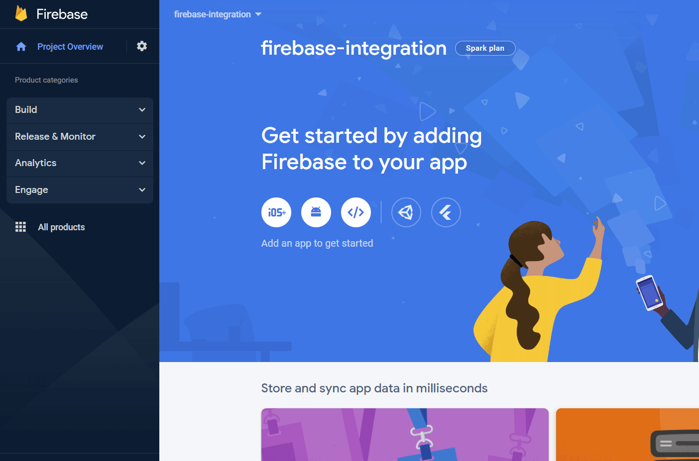
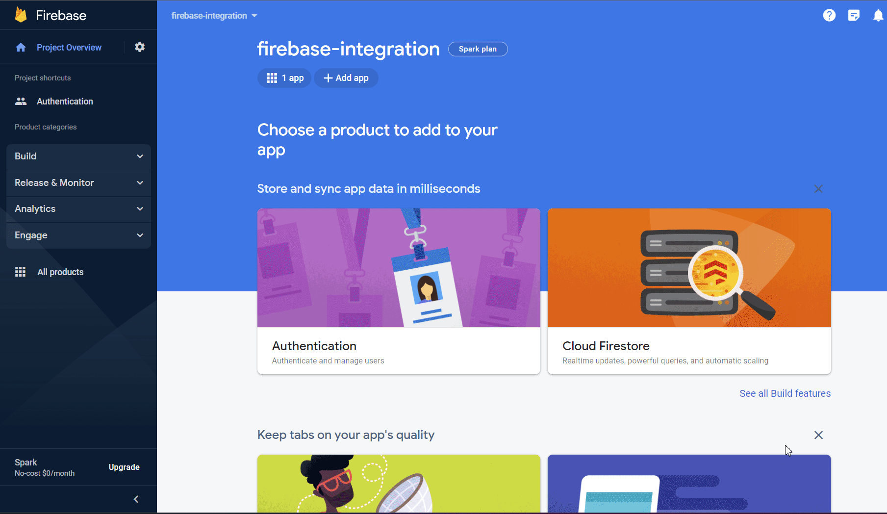
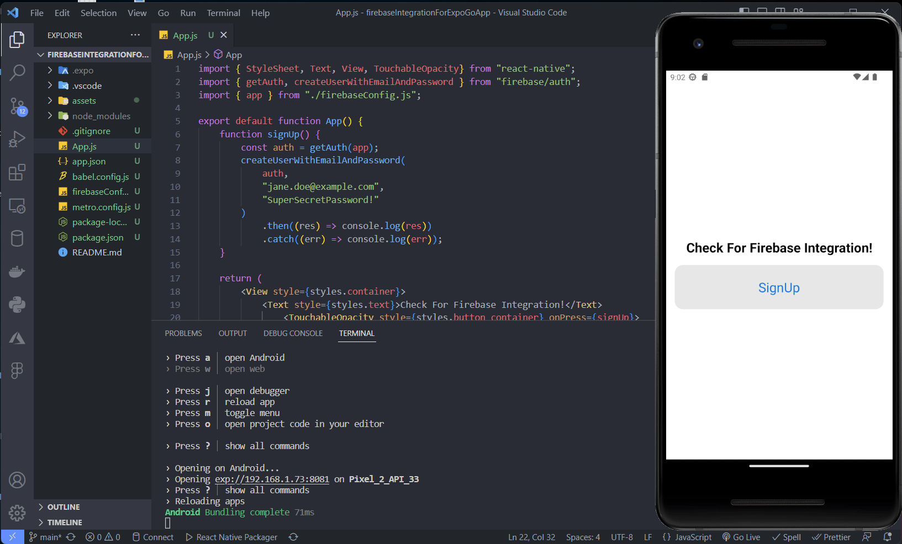
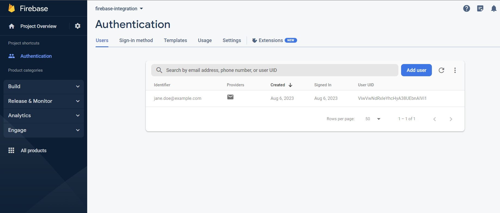

# Firebase Authentication Integration with React Native Expo Go App

Simple Guide to Use Firebase in your app with Expo Go

Decided to prepare a resource because I couldn't find enough information about using Firebase services in my mobile application project written with React Native using Expo Go. In this resource, I will share a simple Firebase Authentication code snippet to see that Firebase integration and setup are completed, and we can continue development with Expo Go App.


To briefly explain what Firebase is, it is a Backend-as-a-Service (BaaS) application development platform that offers backend services such as Realtime Database, Cloud Storage, Authentication, Analytics, and more. It uses Google's infrastructure and is automatically scalable. The fact that many of its features are accessible for free is also a great advantage.

React Native Firebase library does not support Expo Go app. However, it is possible to use some of Firebase's services, not all, in our project using Firebase JS SDK. The installation is also straightforward.


## Creating a Firebase Project and Other Setup:

Firstly, you need to go to the Firebase console and create a Firebase project. Then, since we will install the JS SDK, we need to open a web app in the Firebase project. After registering the app, let's copy the provided config code.



Then, in our project directory, let's add the Firebase JS SDK to our Expo project with the following command:

```
npx expo install firebase
```

During the Web-App setup, we need to create a file named 'firebaseConfig.js' under the root directory and add the Firebase configuration information there. We can access this information from project settings later.

```
// Import the functions you need from the SDKs you need
import { initializeApp } from "firebase/app";
// TODO: Add SDKs for Firebase products that you want to use
// https://firebase.google.com/docs/web/setup#available-libraries

// Your web app's Firebase configuration
const firebaseConfig = {
  apiKey: "",
  authDomain: "",
  projectId: "",
  storageBucket: "",
  messagingSenderId: "",
  appId: ""
};

// Initialize Firebase
export const app = initializeApp(firebaseConfig);
```

In the final step, let's create a file named 'metro.config.js' in the root folder of our project and place the following code inside it.

```
const { getDefaultConfig } = require('@expo/metro-config');
const defaultConfig = getDefaultConfig(__dirname);
defaultConfig.resolver.sourceExts.push('cjs');
module.exports = defaultConfig;
```
That's it! We have completed the installation with the Firebase JS SDK!

We can start using it in our Expo Go App.

## Using Firebase Authentication
Let's verify if the installation of Firebase Authentication is correct by trying a simple signUp process.


```
import { StyleSheet, Text, View, TouchableOpacity} from "react-native";
import { getAuth, createUserWithEmailAndPassword } from "firebase/auth";
import { app } from "./firebaseConfig.js";

export default function App() {
    function signUp() {
        const auth = getAuth(app);

        createUserWithEmailAndPassword(
            auth,
            "jane.doe@example.com",
            "SuperSecretPassword!"
        )
            .then((res) => console.log(res))
            .catch((err) => console.log(err));
            
    }

    return (
        <View style={styles.container}>
            <Text style={styles.text}>Check For Firebase Integration!</Text>

                <TouchableOpacity style={styles.button_container} onPress={signUp}>
                <Text style={styles.button_text}>SignUp</Text>
            </TouchableOpacity>
        </View>
    );
}

const styles = StyleSheet.create({
    container: {
        flex: 1,
        justifyContent: "center",
        marginTop: 48,
    },
    text: {
        fontWeight:"bold",
        textAlign:"center",
        fontSize:24,
    },
    button_text: {
        textAlign:"center",
        fontSize:24,
        color:"#1976d2"
    },
    button_container: {
        borderRadius: 15,
        flexDirection: "row",
        margin: 16,
        padding:24,
        justifyContent:"center",
        backgroundColor:"#e6e6e6"
    },
});

```



Let's check if the code is running and if our user information is displayed in the Firebase console.


Then we can use Firebase's JS SDK supported services in our Expo Go app.

Happy coding!

---
Source: https://docs.expo.dev/guides/using-firebase/

Github: https://github.com/zhrgns/firebaseIntegrationForExpoGoApp

Medium: https://medium.com/@fzehragunes/expo-go-app-ile-firebase-kullan%C4%B1m%C4%B1-ve-firebase-authentication-kurulumu-522079650e29


